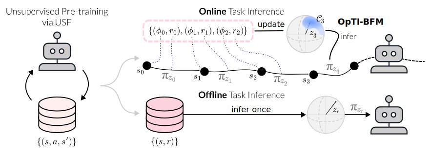

# Optimistic Task Inference for Behavior Foundation Models



## Abstract
Behavior Foundation Models (BFMs) are capable of retrieving high-performing policy for any reward function specified directly at test-time, commonly referred to as zero-shot reinforcement learning (RL). While this is a very efficient process in terms of compute, it can be less so in terms of data: as a standard assumption, BFMs require computing rewards over a non-negligible inference dataset, assuming either access to a functional form of rewards, or significant labeling efforts. To alleviate these limitations, we tackle the problem of task inference purely through interaction with the environment at test-time. We propose OpTI-BFM, an optimistic decision criterion that directly models uncertainty over reward functions and guides BFMs in data collection for task inference. Formally, we provide a regret bound for well- trained BFMs through a direct connection to upper-confidence algorithms for linear bandits. Empirically, we evaluate OpTI-BFM on established zero-shot benchmarks, and observe that it enables successor-features-based BFMs to identify and optimize an unseen reward function in a handful of episodes with minimal compute overhead.

## Overview
- `models`: BFM implementations (FB)
- `agents`: Agent implementations (Oracle, Random, LoLA, OpTI-BFM, OpTI-BFM-TS)
- `dmc`: Custom DMC tasks
- `utils`: General utilities. Most are adapted from [ogbench](https://github.com/seohongpark/ogbench)
- `utils/blr.py`: This is where the math behind OpTI-BFM is implemented.

## Quick Start
We use [uv](https://docs.astral.sh/uv/getting-started/installation/). To initialize run once
```bash
uv sync .
```
### Training
Use the `download_exorl.sh` script to download the training data
```bash
./exorl_download.sh walker rnd ~/.exorl
```
Then run the following to train FB on DMC Walker (other environments `dmc_cheetah-rnd-v0`, `dmc_quadruped-rnd-v0`)
```bash
uv run main.py wandb_mode=online seed=0 train_steps=2000000 num_eval=20 num_eval_episodes=1 agent=oracle model=fb env_name=dmc_walker-rnd-v0
```

### Evaluation
#### Main Results
Run the following to evaluate the baselines and OpTI-BFM (`agent=ucb`) and OpTI-BFM-TS (`agent=ts`).
Each agent has individual hyper-parameters, see the corresponding classes and `register_cfg(...)` calls in `agents`.
```bash
uv run main.py train_steps=0 seed=null restore_path=<path_to_your_training_working_dir> restore_epoch=2000000 num_eval=10 num_eval_episodes=10 agent=oracle
uv run main.py train_steps=0 seed=null restore_path=<path_to_your_training_working_dir> restore_epoch=2000000 num_eval=10 num_eval_episodes=10 agent=random agent.r=1
uv run main.py train_steps=0 seed=null restore_path=<path_to_your_training_working_dir> restore_epoch=2000000 num_eval=10 num_eval_episodes=10 agent=lola
uv run main.py train_steps=0 seed=null restore_path=<path_to_your_training_working_dir> restore_epoch=2000000 num_eval=10 num_eval_episodes=10 agent=ucb agent.beta=0.1 agent.r=1
uv run main.py train_steps=0 seed=null restore_path=<path_to_your_training_working_dir> restore_epoch=2000000 num_eval=10 num_eval_episodes=10 agent=ts agent.sigma=0.01 agent.r=1
```

#### Episodic Updates Results
Repeat the runs above with `num_eval_episodes=50` and `agent.r=1000` where aplicable.

#### Data Efficiency
1. Run the evaluations for `random`, `ts`, and `ucb` with the `full_log=True` flag to store all observed trajectories.
2. Then use `scripts/experience_datasets.py` to extract the observation-reward pairs from the trajectories.
3. Evaluate the `oracle` with different data sources: `env_sample_mode=<agent-random|agent-ts|agent-ucb|random>` for Random, OpTI-BFM-TS, OpTI-BFM, and RND respectively. Use the `env_num_samples=<n>` to control the inference dataset size.

#### Non-Stationary Rewards
The velocity tracking tasks `speedup` and `slowdown` are implemented for the `dmc_hybrid_walker-rnd-v0` environment at the end of file `dmc/custom_dmc_tasks/walker.py`.
To evaluate, run
```bash
uv run main.py train_steps=0 restore_path=<path_to_your_training_working_dir> restore_epoch=2000000 num_eval=10 num_eval_episodes=1 num_eval_steps=30_000 agent=<ucb|ts> env_name=dmc_hybrid_walker-rnd-v0 agent.decay=0.999
```

#### Warm-Starting
By default `ucb` and `ts` agents will not use the task provided in the evaluation (you can set it to `None` explicitly with `eval_with_task=False`)
Set `agent.zsrl=True` if you want them to use the provided labelled dataset to warm-start the online task inference.

#### D-Gap Thresholding
You can control aquisition of `ucb` and `ts` by setting its threshold `agent.kappa` for the D-gap to a positive value.
